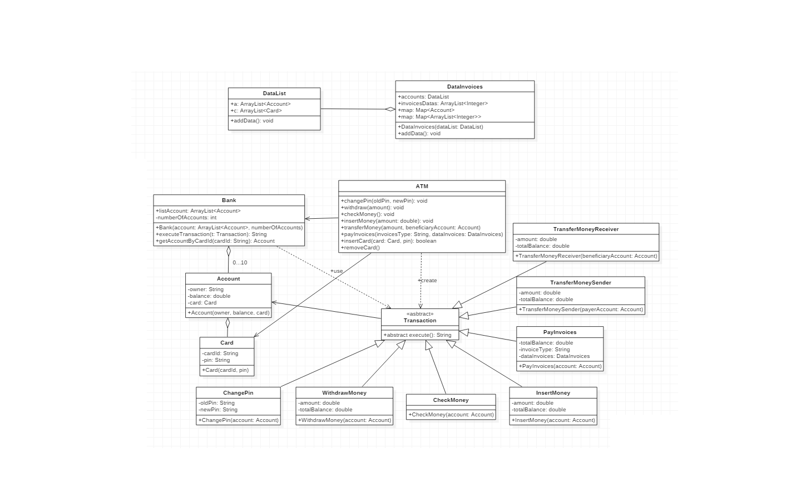

# ATM

   _DESCRIPTION_
   
   I have created a real time accesing ATM with JAVA programing language. I stored 10 accounts with different ids and pins where you can acces one of these accounts in ATM and do transactions, such as: withdraw, insert money, check money, view private data, transfer money from another account, and pay invoices from gass, water an electricity services.
   Each usser account has own bank card that should be introduced in ATM to make transactions. When the card is removed, ATM will request again to introduce the card and the pin.
   
   _WHAT I USED_
   
   I used _map_ and _lists_ for storing the data. 
   I used _abstracted_ class for classes that extends transaction metod.
   I uesd Aggregation and Generalization relations.
   
   1._METHODS_
    * _insertCard()_ method from ATM will compare received pin with the pin stored in card. If 2 pins match the card will be stored as attribute and will be used for executing transactions.
    * _removeCard()_ method will invalidate a previously inserted card by making the attribute null.
    * _transferMoney()_ method whitch use 2 classes _transferMoneySender_ and _transferMoneyReceiver_ will acces first _transferMoneySender_ where it will take the money from current account, and beneficiary user will receive the amount of money in _transferMoneyReceiver_ where it will be stored in beneficiary account. Payer should introduce the id of beneficary user to make the transaction.
    * _payInvoices()_ is a method where you can pay invoices from gass, water and electricity consumed. This method access data from *InvoicesData where is stocated the amount of money that users should pay for these utilities consumed. When user acces this method and pay from one of each utilities, the money from user account is taken and the invoice is paid.

